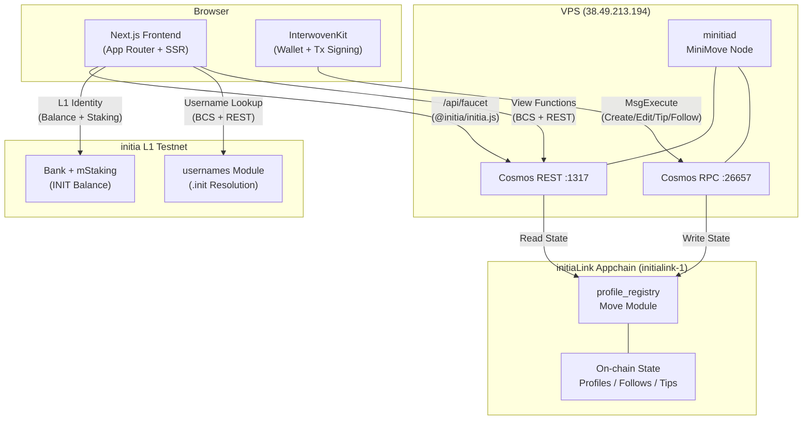

# initiaLink

Link-in-bio, but on-chain. Your `.init` username is your profile URL.

**Track:** Gaming & Consumer (digital identity)

**Repo:** [github.com/jordi-stack/initia-link](https://github.com/jordi-stack/initia-link)

## What is this

initiaLink lets you create a profile page tied to your initia username. Add your links and bio, set an avatar. Other users can tip you (native tokens, no platform cut) and follow you. One Move module stores everything, no backend, no database.

Visit `yourapp.com/alice.init` and you see Alice's profile. She doesn't need to be online, and the visitor doesn't need a wallet to view it.

## Why not just use Linktree

Linktree owns your profile. They host it and charge you for premium features. If they go down or change their terms, your page disappears.

Linktree also doesn't know anything about crypto. You can't tip someone, follow them on-chain, or verify their identity through their wallet. A list of links on someone else's server.

initiaLink stores everything in a Move module on a dedicated initia MiniMove appchain. Your profile is yours. Tips go straight to your wallet, and the follow graph is on-chain too. Because it runs on its own appchain, transaction fees become app revenue.

Other alternatives and why they don't fit:
- **Bento** -- same centralized problem as Linktree, just prettier
- **ENS profiles** -- Ethereum only, no social features, no tipping
- **Lens/Farcaster** -- locked to their own ecosystems, not initia-native

## How it works

One Move module (`profile_registry`) handles everything:
- Profile CRUD (bio, avatar, up to 10 labeled links)
- Tipping via `coin::transfer` (min 1 GAS, sent directly to the profile owner)
- Social graph (follow/unfollow, follower and following lists, paginated queries)
- Discovery feed (newest profiles on-chain, popular sorted by overall score, followers, tip count, or total tipped)
- Tip history stored on-chain (view function, no event log parsing needed)

The server resolves `.init` usernames by calling L1 Move view functions (BCS-encoded, over REST) and renders profile pages with Open Graph meta tags. Share a link on Twitter or Discord and it shows the right preview.

## initia integration

Five native features used:

1. **initia Usernames (.init)** -- your username is your URL. Forward resolution (name to address) and reverse resolution (address to name) both work, so even if someone shares a raw address link, the page still shows the `.init` name.

2. **MiniMove Appchain** -- the profile registry runs as a Move module on a dedicated MiniMove rollup. Move's resource ownership model and the Aptos-variant MoveVM give type safety and composability that Solidity can't match.

3. **Auto-signing** -- session-based auto-signing through InterwovenKit. Enable it once from the wallet dropdown, approve in your wallet, and all subsequent transactions (editing, following, tipping) go through without confirmation dialogs. Uses `/initia.move.v1.MsgExecute` permissions. Only possible on MiniMove (not MiniEVM).

4. **InterwovenKit** -- wallet connection and transaction signing. Supports initia Wallet, Keplr, MetaMask, and others. Contract writes go through Cosmos `MsgExecute` via `requestTxBlock`, with BCS-encoded arguments.

5. **L1 Cross-Rollup Identity** -- each profile page queries the initia L1 testnet for the user's INIT balance and staking positions. The appchain frontend reaches into L1 state via REST API, showing how data flows across rollup boundaries. Uses initia's `mstaking` module for multi-asset staking queries.

## Architecture



## Live appchain

The initiaLink MiniMove appchain runs on a dedicated VPS.

| Endpoint | URL |
|---|---|
| Cosmos RPC | `http://38.49.213.194:26657` |
| Cosmos REST | `http://38.49.213.194:1317` |
| Chain ID | `initialink-1` |
| VM | MiniMove (Aptos MoveVM) |
| Module deploy TX | `09DA5492E7AA8A47F6A701B4565EBCEB0045945DD9E9F77A07909F90BEEB0ECC` |

Verify the node is running: `curl http://38.49.213.194:26657/status`

## Running locally

```bash
git clone https://github.com/jordi-stack/initia-link.git
cd initia-link
npm install
cp .env.example .env
npm run dev
```

Open `http://localhost:3000`, connect your wallet, and the onboarding stepper walks you through getting GAS and creating a profile.

## Full setup from scratch

### 1. Download and start a MiniMove node

```bash
# Download minimove binary (Linux x86_64)
curl -sL https://github.com/initia-labs/minimove/releases/download/v1.1.11/minimove_v1.1.11_Linux_x86_64.tar.gz | tar xz -C /usr/local/bin/

# Initialize the chain
export LD_LIBRARY_PATH=/usr/local/bin
minitiad init operator --chain-id initialink-1 --home ~/.initialink

# Configure genesis (set GAS denom, add validator, fund deployer)
# See the genesis setup in the repo wiki or contact the maintainer

# Start the node
minitiad start --home ~/.initialink
```

### 2. Deploy the Move module

```bash
minitiad move deploy \
  --path contracts/move/profile_registry \
  --upgrade-policy COMPATIBLE \
  --from deployer \
  --gas auto --gas-adjustment 1.5 \
  --gas-prices 0GAS \
  --chain-id initialink-1 \
  --node http://localhost:26657 \
  --home ~/.initialink \
  --keyring-backend test -y
```

### 3. Configure environment

Update `.env` with your node endpoints and the deployed module address:

```
NEXT_PUBLIC_MODULE_ADDRESS=0x<your_deployer_hex_address>
NEXT_PUBLIC_COSMOS_RPC=http://localhost:26657
NEXT_PUBLIC_COSMOS_REST=http://localhost:1317
NEXT_PUBLIC_GAS_METADATA=<query via: minitiad query move view 0x1 coin metadata_address --args '["address:0x1","string:GAS"]'>
```

### 4. Run the frontend

```bash
npm install
npm run dev
```

## Tech

- Next.js 16, TypeScript, Tailwind CSS v4
- Move (Aptos-variant MoveVM on MiniMove rollup)
- BCS encoding for Move view function calls and transaction args
- InterwovenKit (`@initia/interwovenkit-react`) for wallet and tx
- `@initia/initia.js` for faucet (server-side tx signing)
- initia L1 REST API for `.init` username resolution and cross-rollup identity
- sonner for toast notifications

## Pages

| Route | What it does |
|---|---|
| `/` | Landing page |
| `/edit` | Guided onboarding (connect, faucet, username) then create/edit profile |
| `/discover` | Browse profiles, search by username, sort by new or popular (followers, tip count, total tipped) |
| `/dashboard` | Your stats, recent tips received, who you follow |
| `/alice.init` | Public profile page (server-rendered, no wallet needed) |

## Move Module

`profile_registry` deployed at `0xE6638AB1AD3530282D4FA9E13D5BC1189EC6125D` on the initiaLink MiniMove appchain (`initialink-1`).

## Features worth noting

- Platform icons with URL auto-detection (Twitter, GitHub, Instagram, YouTube, LinkedIn, Discord, Telegram, TikTok)
- Discover feed with username search, Load More pagination, and multi-criteria sort
- Navbar adapts: "Create Profile" becomes "My Profile" linking to your profile page once you have one
- Share profiles to X, Telegram, or copy link; QR code for each profile
- Dynamic Open Graph images for rich previews when sharing on Discord, X, Telegram
- Dashboard with recent tip history (on-chain records) and following list with resolved usernames
- Follow/Tip buttons hidden on your own profile, follow state checked on-chain
- L1 cross-rollup identity card on profiles (INIT balance, staked amount, validator count from initia testnet)
- Profile themes (12 presets + custom color picker with native color dialog) stored on-chain in bio field
- Clickable follower/following counts open paginated list modal with username resolution
- Dark mode with toggle in navbar, localStorage persistence, no flash on reload, all components use CSS variables
- Two-column edit page (form + sticky live preview) with compact link cards and section grouping
- Guided onboarding stepper for new users (connect wallet, get GAS, register .init, create profile)
- Auto-sign for frictionless transactions (MiniMove only)
- Skeleton loading placeholders while data fetches
- Scroll-triggered animations via Intersection Observer
- Animated gradient avatar rings (themed per profile), hover effects, shimmer buttons

## Who this is for

Crypto-native creators, builders, and community members who want a single landing page tied to their on-chain identity. You already have an `.init` username and want to share your socials, receive tips, and build a follower base without trusting a centralized platform. initiaLink runs on a dedicated appchain where the app controls its own fees and throughput.

## Structure

```
contracts/move/profile_registry/  Move module (profile_registry.move)
src/app/             pages (/, /edit, /discover, /dashboard, /[username])
src/app/api/         API routes (faucet, l1-identity)
src/components/      UI components (Navbar, EditProfileForm, DarkModeToggle, FollowListModal, etc.)
src/hooks/           useContractWrite (MsgExecute), useScrollReveal
src/lib/             contract reads, BCS encoding, constants, username resolution, themes, L1 identity
public/              favicon
```
