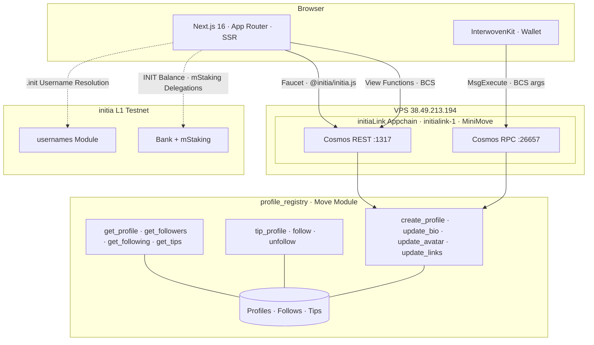

# initiaLink

Link-in-bio, but on-chain. Your `.init` username is your profile URL.

**Track:** Gaming & Consumer

**Live:** [initia-link.vercel.app](https://initia-link.vercel.app/)

**Demo:** [youtu.be/MEkOyIOcwqM](https://youtu.be/MEkOyIOcwqM)

**Repo:** [github.com/jordi-stack/initia-link](https://github.com/jordi-stack/initia-link)

## Initia Hackathon Submission

- **Project Name**: initiaLink

### Project Overview

initiaLink is an on-chain link-in-bio platform where your `.init` username is your profile URL. It replaces centralized link aggregators (Linktree, Beacons) for crypto-native creators by storing profiles, the follow graph, tip history, and themes in a single Move module on a dedicated MiniMove appchain. Visitors can tip in native GAS and follow creators directly from their wallet, with zero platform cut and no off-chain database.

### Implementation Detail

- **The Custom Implementation**: Single Move module (`profile_registry`) that owns profiles, a composite-key follow graph, on-chain tip records, and themes (12 presets + custom color picker encoded inside the bio field, so no contract changes are needed to add more). The frontend pairs this with a cross-rollup identity card that reads INIT balance and `mstaking` delegations from initia L1 REST, a guided 4-step onboarding stepper (connect wallet, get GAS, register `.init`, create profile), a two-column edit page with sticky live preview, dynamic Open Graph images per profile, and a discover feed with username search and sort-by-followers/tips.
- **The Native Feature**: `initia-usernames`. The `.init` username is the URL itself (`initia-link.vercel.app/alice.init`), with no separate domain or ENS record to configure. Both forward resolution (`get_address_from_name`) and reverse resolution (`get_name_from_address`) are called on the L1 `usernames` Move module via BCS-encoded view functions, so even raw hex addresses in the discover feed and dashboard render as the `.init` name creators' communities already recognize.

### How to Run Locally

1. `git clone https://github.com/jordi-stack/initia-link.git && cd initia-link && npm install`
2. `cp .env.example .env` (preconfigured to point at the live initiaLink appchain at `38.49.213.194`, so no local node is required)
3. `npm run dev` and open `http://localhost:3000`
4. Connect your wallet through InterwovenKit; the onboarding stepper will request GAS from the in-app faucet, help you register a `.init` username, and create your first profile

For a full local appchain + deploy from scratch, see [Full setup from scratch](#full-setup-from-scratch) further down.

## What is this

initiaLink lets you create a profile page tied to your initia username. Add your links and bio, set an avatar. Other users can tip you (native tokens, no platform cut) and follow you. One Move module stores everything, no backend, no database.

Visit `initia-link.vercel.app/alice.init` and you see Alice's profile. She doesn't need to be online, and the visitor doesn't need a wallet to view it.

## Why on-chain

Traditional link-in-bio platforms own your profile. They host it, charge for premium features, and if they go down or change terms, your page disappears. They also don't understand crypto -- no tipping, no on-chain follows, no wallet-based identity.

initiaLink stores everything in a Move module on a dedicated initia MiniMove appchain. Your profile is yours. Tips go straight to your wallet, and the follow graph is on-chain too. Because it runs on its own appchain, transaction fees become app revenue.

## initia integration

Five native features used:

1. **initia Usernames (.init)** -- your username is your URL. Forward and reverse resolution both work, so even raw address links show the `.init` name.

2. **MiniMove Appchain** -- the profile registry runs as a Move module on a dedicated MiniMove rollup. Move's resource ownership model gives type safety and composability that Solidity can't match.

3. **Auto-signing** -- session-based auto-signing through InterwovenKit. Enable once, and all subsequent transactions go through without confirmation dialogs. Only possible on MiniMove (not MiniEVM).

4. **InterwovenKit** -- wallet connection and transaction signing via Cosmos `MsgExecute` with BCS-encoded arguments. Supports initia Wallet, Keplr, MetaMask, and others.

5. **L1 Cross-Rollup Identity** -- each profile page queries initia L1 testnet for the user's INIT balance and staking positions via REST API. Uses initia's `mstaking` module for multi-asset staking queries.

## Architecture



## Live appchain

| Endpoint | URL |
|---|---|
| Cosmos RPC | `http://38.49.213.194:26657` |
| Cosmos REST | `http://38.49.213.194:1317` |
| Chain ID | `initialink-1` |
| VM | MiniMove (Aptos MoveVM) |
| Deploy TX | [09DA5492...BEEB0ECC](http://38.49.213.194:26657/tx?hash=0x09DA5492E7AA8A47F6A701B4565EBCEB0045945DD9E9F77A07909F90BEEB0ECC) |

Verify the node is running: `curl http://38.49.213.194:26657/status`

## Features

**On-chain social**
- Tip any profile with native GAS tokens (sent directly to wallet, no platform cut)
- Follow/unfollow with on-chain social graph, paginated follower/following lists
- Discover feed with username search, Load More pagination, sort by followers/tips/overall
- Dashboard with recent tip history and following list (all from on-chain state)

**Identity and personalization**
- L1 cross-rollup identity card (INIT balance, staked amount, validator count from initia testnet)
- 12 profile themes + custom color picker with native color dialog, stored on-chain in bio field
- Dynamic Open Graph images for rich link previews on X, Discord, Telegram
- Share to X, Telegram, copy link, and QR code per profile

**UX**
- Guided onboarding stepper (connect wallet, get GAS, register .init, create profile)
- Auto-sign for frictionless transactions (MiniMove only)
- Dark mode with navbar toggle, localStorage persistence, no flash on reload
- Two-column edit page with sticky live preview and theme-aware banner

## Pages

| Route | What it does |
|---|---|
| `/` | Landing page |
| `/edit` | Guided onboarding, then create/edit profile |
| `/discover` | Browse and search profiles |
| `/dashboard` | Your stats, tips received, who you follow |
| `/alice.init` | Public profile page (server-rendered, no wallet needed) |

## Tech

- Next.js 16, TypeScript, Tailwind CSS v4
- Move (Aptos-variant MoveVM on MiniMove rollup)
- BCS encoding for Move view function calls and transaction args
- InterwovenKit (`@initia/interwovenkit-react`) for wallet and tx
- `@initia/initia.js` for faucet (server-side tx signing)
- initia L1 REST API for `.init` username resolution and cross-rollup identity

## Who this is for

Crypto-native creators, builders, and community members who want a single landing page tied to their on-chain identity. You already have an `.init` username and want to share your socials, receive tips, and build a follower base without trusting a centralized platform. initiaLink runs on a dedicated appchain where the app controls its own fees and throughput.

## Competitive landscape

Linktree and similar platforms host your profile on their servers. If they go down, change pricing, or ban your account, your page disappears. Crypto-native alternatives exist -- Lens Protocol lets users build profile pages, and ENS records can point to static sites -- but neither is designed for the Initia ecosystem, and neither gives you a URL that maps directly to a username your followers already know.

initiaLink treats the `.init` username as the URL. There is no separate domain, no ENS record to configure, no IPFS hash to pin. Your username is `alice.init`, your profile is at `initia-link.vercel.app/alice.init`. The profile data lives in a Move module on a dedicated appchain, so the app captures transaction fees rather than leaking them to a shared sequencer.

## Go-to-market

The initial audience is Initia ecosystem users who already hold `.init` usernames. Every wallet connected to an Initia app is a potential profile. The on-chain follow graph creates natural distribution -- your followers see when you update links, and the discover feed surfaces new profiles to the community. The faucet and onboarding stepper lower the barrier for users who haven't transacted on initiaLink before.

## Running locally

```bash
git clone https://github.com/jordi-stack/initia-link.git
cd initia-link
npm install
cp .env.example .env
npm run dev
```

Open `http://localhost:3000`, connect your wallet, and the onboarding stepper walks you through getting GAS and creating a profile.

## Full setup from scratch

### 1. Download and start a MiniMove node

```bash
curl -sL https://github.com/initia-labs/minimove/releases/download/v1.1.11/minimove_v1.1.11_Linux_x86_64.tar.gz | tar xz -C /usr/local/bin/

export LD_LIBRARY_PATH=/usr/local/bin
minitiad init operator --chain-id initialink-1 --home ~/.initialink

# Configure genesis (set GAS denom, add validator, fund deployer)
minitiad start --home ~/.initialink
```

### 2. Deploy the Move module

```bash
minitiad move deploy \
  --path contracts/move/profile_registry \
  --upgrade-policy COMPATIBLE \
  --from deployer \
  --gas auto --gas-adjustment 1.5 \
  --gas-prices 0GAS \
  --chain-id initialink-1 \
  --node http://localhost:26657 \
  --home ~/.initialink \
  --keyring-backend test -y
```

### 3. Configure environment

```
NEXT_PUBLIC_MODULE_ADDRESS=0x<your_deployer_hex_address>
NEXT_PUBLIC_COSMOS_RPC=http://localhost:26657
NEXT_PUBLIC_COSMOS_REST=http://localhost:1317
NEXT_PUBLIC_GAS_METADATA=<query via: minitiad query move view 0x1 coin metadata_address --args '["address:0x1","string:GAS"]'>
```

### 4. Run the frontend

```bash
npm install
npm run dev
```

## Move Module

`profile_registry` deployed at `0xE6638AB1AD3530282D4FA9E13D5BC1189EC6125D` on the initiaLink MiniMove appchain (`initialink-1`).

## Structure

```
contracts/move/profile_registry/  Move module (profile_registry.move)
src/app/             pages (/, /edit, /discover, /dashboard, /[username])
src/app/api/         API routes (faucet, l1-identity, view proxy, balance proxy)
src/components/      UI components
src/hooks/           useContractWrite (MsgExecute), useScrollReveal
src/lib/             contract reads, BCS encoding, username resolution, themes
public/              favicon
```
